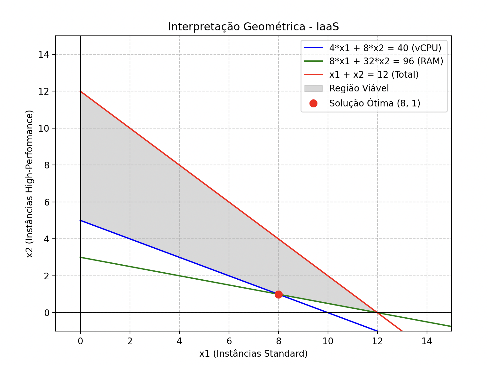
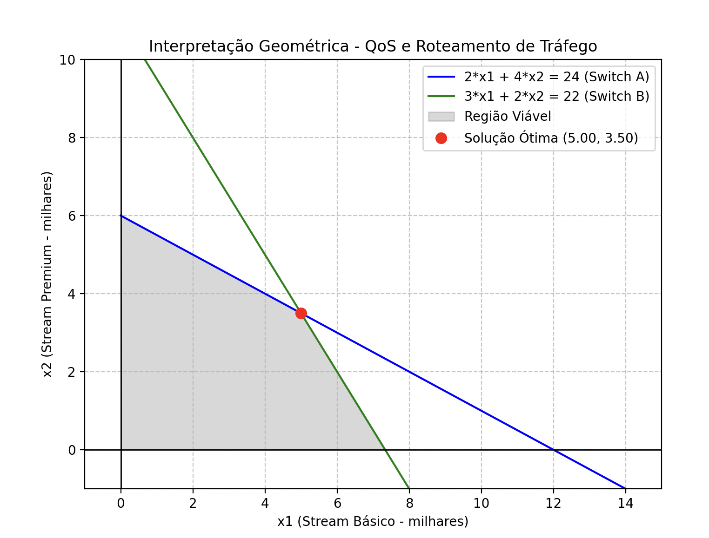
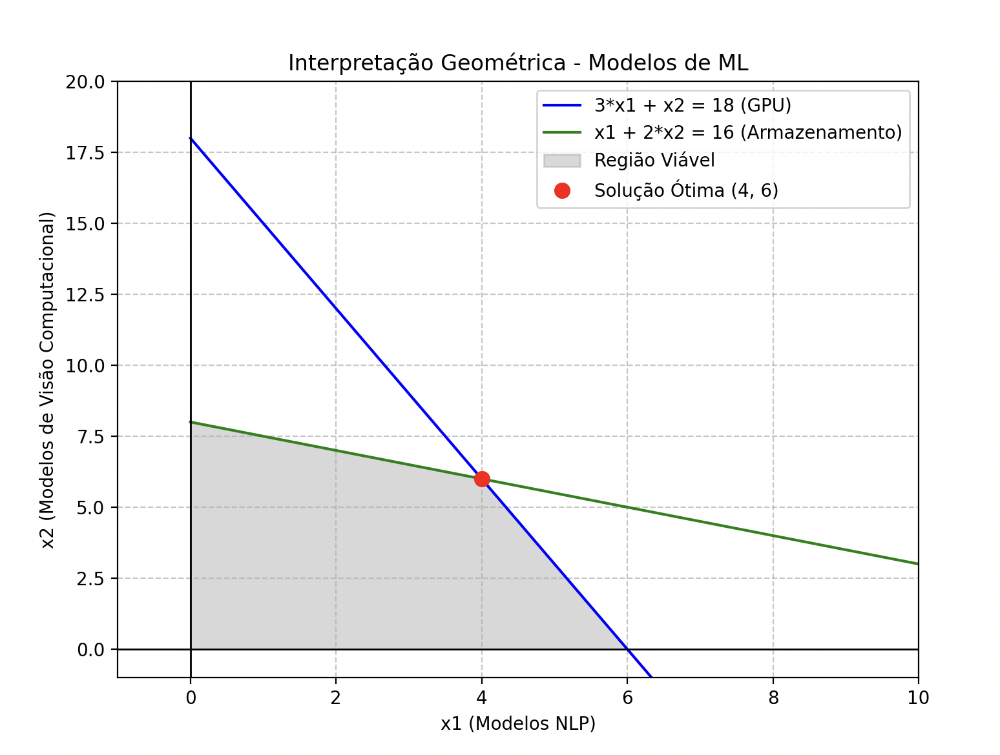
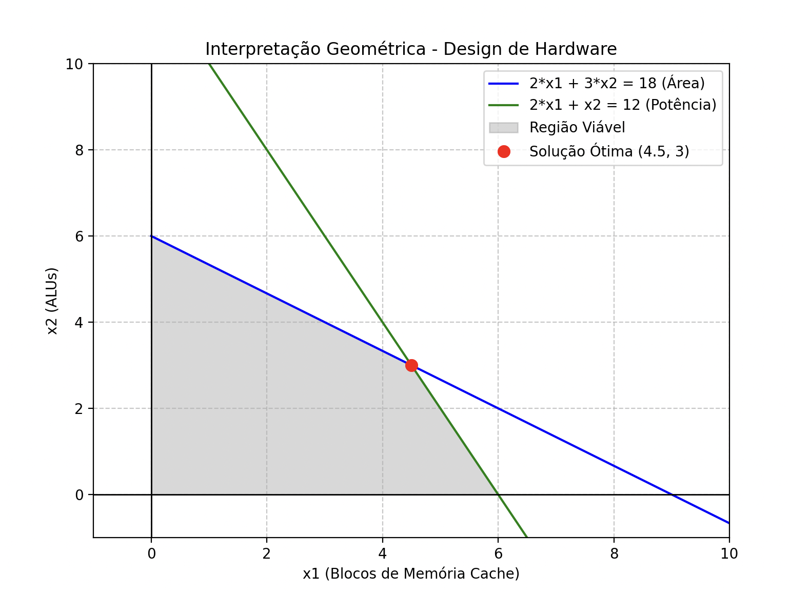
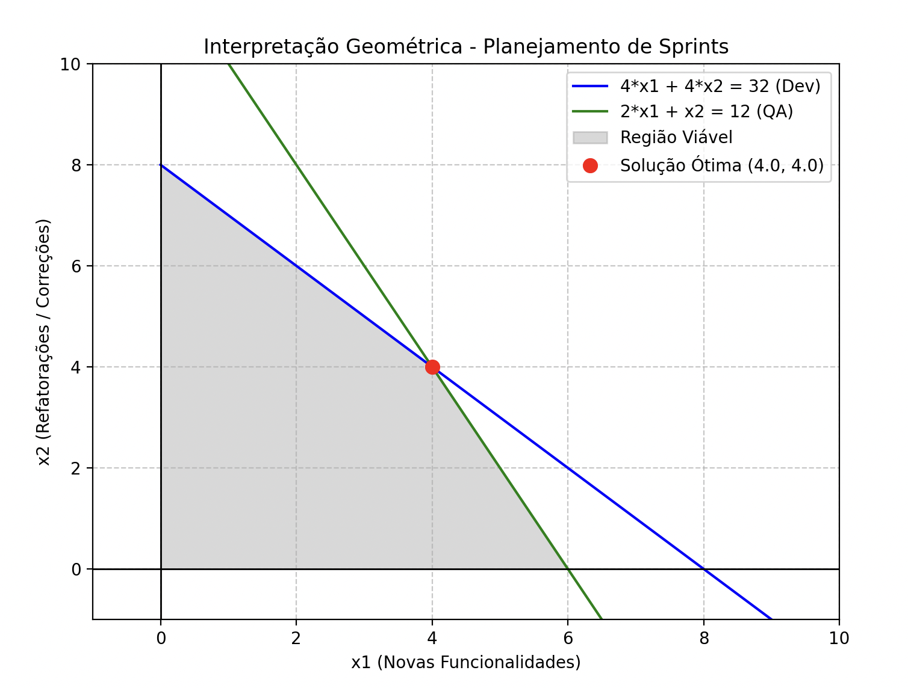

# Resolução: Lista de Exercícios - Programação Linear

Thiago Marzari Rossato

---

## Exercício 1: Otimização de Infraestrutura em Nuvem (IaaS)

**Objetivo:** Minimizar o custo de instâncias.

**Solução Ótima Encontrada:**

- **Instâncias Standard ($x_1$):** 8
- **Instâncias High-Performance ($x_2$):** 1
- **Custo Mínimo:** \$ 210,00

---

## Exercício 2: Alocação de Banda e Roteamento de Tráfego

**Objetivo:** Maximizar a pontuação de QoS (Quality of Service).

**Solução Ótima Encontrada:**

- **Stream Básico ($x_1$):** 5.00 (em milhares)
- **Stream Premium ($x_2$):** 3.50 (em milhares)
- **QoS Máximo:** 32.50 pontos

---

## Exercício 3: Treinamento de Modelos de Deep Learning

**Objetivo:** Maximizar o impacto científico.

**Solução Ótima Encontrada:**

- **Modelos NLP ($x_1$):** 4
- **Modelos de Visão Computacional ($x_2$):** 6
- **Impacto Científico Máximo:** 34 pontos

---

## Exercício 4: Design de Hardware (Sistemas Embarcados / IoT)

**Objetivo:** Maximizar a eficiência energética do chip.

**Solução Ótima Encontrada:**

- **Blocos de Memória Cache ($x_1$):** 4.5
- **Unidades Aritméticas - ALUs ($x_2$):** 3
- **Eficiência Energética Máxima:** 34.5 unidades

---

## Exercício 5: Planejamento de Sprints (Metodologia Ágil)

**Objetivo:** Maximizar o valor de negócio entregue na Sprint.

**Solução Ótima Encontrada:**

- **Novas Funcionalidades ($x_1$):** 4
- **Refatoração de Código / Bugs ($x_2$):** 4
- **Valor Máximo Entregue:** 52 pontos
